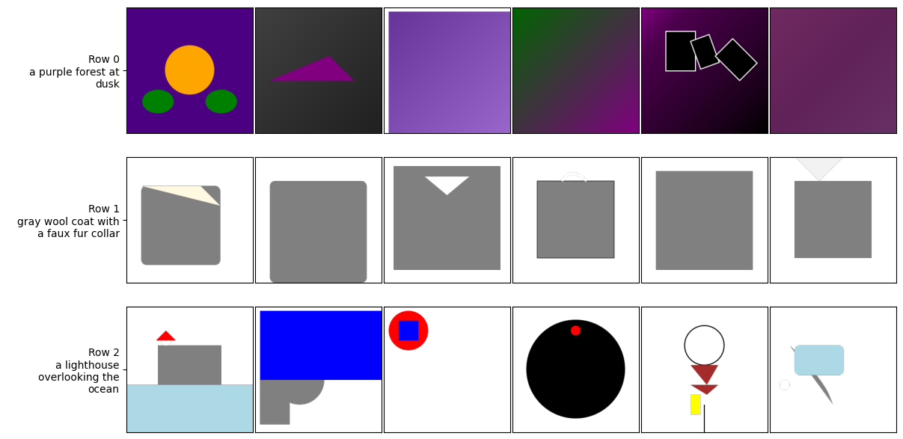

# drawing-wit-llms

This GitHub project presents a solution to the <strong>Kaggle competition</strong> <a href="https://www.kaggle.com/competitions/drawing-with-llms"> "Drawing with LLMs"</a>. The challenge involves generating SVG images from text descriptions using AI models.

## Model Validation
This project explores various multimodal AI models. The validation process is composed of two main components:
 <ol>
    <li>
      <strong>Aesthetic Score Evaluation</strong> 
      This score assesses the visual appeal of the generated image. 
      A <strong>CLIP model</strong> is used to process images and return a metric reflecting their aesthetic quality.
    </li>
     
    <li>
      <strong>Visual Question Answering (VQA) Evaluation</strong> 
      A <strong>PaliGemma 2</strong> model receives an image and a set of questions. 
      It returns a score indicating how well the image corresponds to the given textual input.
    </li>
  </ol>

  
All models are available on <strong>Hugging Face</strong>.

## First approach - Using Gemma 2

<ul>
<li> Our initial approach used the <strong>Gemma 2</strong> model to directly generate SVG images from text. However, the performance was very poor, as shown in the example below:
 

 
</ul>

## Second approach - Using Stable Diffusion 
<ul>
In this method, we used a Stable Diffusion model to generate an image from a text description.
The resulting image (left) was then converted to SVG format (right) using a custom image processing algorithm based on K-means clustering, which also included SVG size reduction.
However, despite these optimizations, the final SVG files still exceeded the 10,000-byte size limit required by the competition.
<li> <strong>Description: </strong> A lighthouse overlooking the ocean
 

 
<li> <strong>Description: </strong> A purple forest at dusk
 

</ul>

## Third approach - Reinforcement Learning and LoRA
<ul>
<li> Our third  approach combines Reinforcement Learning with LoRA (Low-Rank Adaptation). This method aims to improve image quality while keeping the SVG file size within the competition constraints.
</ul>

